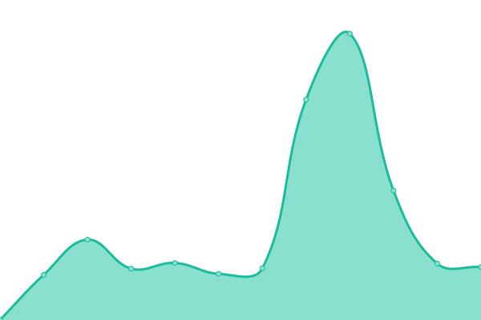
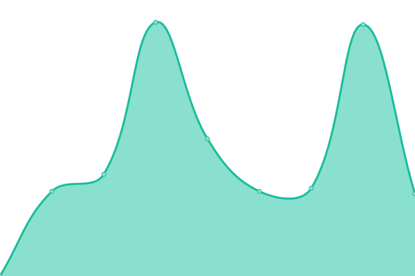
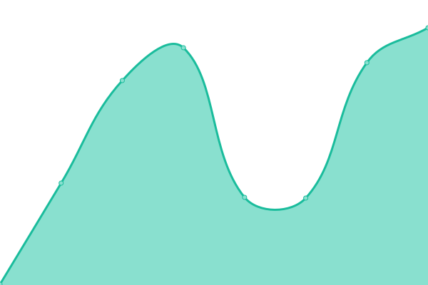
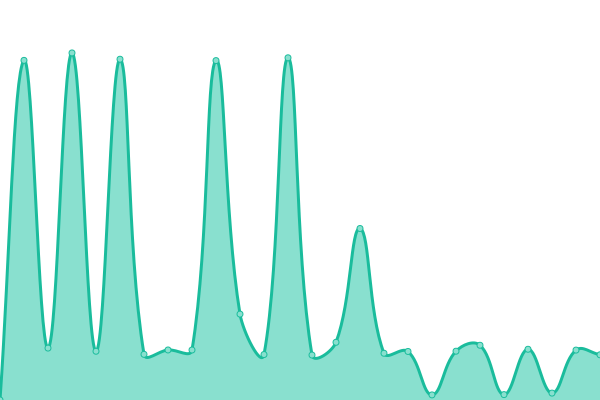

# [📈 Live Status](https://chamannarved.github.io/drabdigital-uptime-moniter): <!--live status--> **🟩 All systems operational**

This repository contains the open-source uptime monitor and status page for [Chaman Narved ](https://chamannarved.github.io/drabdigital-uptime-moniter), powered by [Upptime](https://github.com/upptime/upptime).

With [Upptime](https://upptime.js.org), you can get your own unlimited and free uptime monitor and status page, powered entirely by a GitHub repository. We use [Issues](https://github.com/chamannarved/drabdigital-uptime-moniter/issues) as incident reports, [Actions](https://github.com/chamannarved/drabdigital-uptime-moniter/actions) as uptime monitors, and [Pages](https://chamannarved.github.io/drabdigital-uptime-moniter) for the status page.

<!--start: status pages-->
<!-- This summary is generated by Upptime (https://github.com/upptime/upptime) -->
<!-- Do not edit this manually, your changes will be overwritten -->
<!-- prettier-ignore -->
| URL | Status | History | Response Time | Uptime |
| --- | ------ | ------- | ------------- | ------ |
|  [DrabDigital](https://drabdigital.com) | 🟩 Up | [drab-digital.yml](https://github.com/chamannarved/drabdigital-uptime-moniter/commits/HEAD/history/drab-digital.yml) | 

 3312ms
     
 | 

<a href="https://chamannarved.github.io/drabdigital-uptime-moniter/history/drab-digital">100.00%</a>
    

|  [Wonderland Treks & Tours](https://wonderland-india.com) | 🟩 Up | [wonderland-treks-and-tours.yml](https://github.com/chamannarved/drabdigital-uptime-moniter/commits/HEAD/history/wonderland-treks-and-tours.yml) | 

 951ms
     
 | 

<a href="https://chamannarved.github.io/drabdigital-uptime-moniter/history/wonderland-treks-and-tours">99.37%</a>
    

|  [Origin Academy Singapore](https://theoriginacademy.com) | 🟩 Up | [origin-academy-singapore.yml](https://github.com/chamannarved/drabdigital-uptime-moniter/commits/HEAD/history/origin-academy-singapore.yml) | 

 9375ms
     
 | 

<a href="https://chamannarved.github.io/drabdigital-uptime-moniter/history/origin-academy-singapore">100.00%</a>
    

|  [Kuber Fast Meals](https://kuberfastmeals.in) | 🟩 Up | [kuber-fast-meals.yml](https://github.com/chamannarved/drabdigital-uptime-moniter/commits/HEAD/history/kuber-fast-meals.yml) | 

 1953ms
     
 | 

<a href="https://chamannarved.github.io/drabdigital-uptime-moniter/history/kuber-fast-meals">100.00%</a>
    

|  [Blissify](https://blissify.ca) | 🟩 Up | [blissify.yml](https://github.com/chamannarved/drabdigital-uptime-moniter/commits/HEAD/history/blissify.yml) | 

 217ms
     
 | 

<a href="https://chamannarved.github.io/drabdigital-uptime-moniter/history/blissify">100.00%</a>
    

|  [Hotal The Nest](https://hotelthenest.com/) | 🟩 Up | [hotal-the-nest.yml](https://github.com/chamannarved/drabdigital-uptime-moniter/commits/HEAD/history/hotal-the-nest.yml) | 

 2735ms
     
 | 

<a href="https://chamannarved.github.io/drabdigital-uptime-moniter/history/hotal-the-nest">100.00%</a>
    

|  [Blue Diamonds Adventure](https://bluediamondsadventure.com) | 🟩 Up | [blue-diamonds-adventure.yml](https://github.com/chamannarved/drabdigital-uptime-moniter/commits/HEAD/history/blue-diamonds-adventure.yml) | 

 4076ms
     
 | 

<a href="https://chamannarved.github.io/drabdigital-uptime-moniter/history/blue-diamonds-adventure">100.00%</a>
    

<!--end: status pages-->

[**Visit our status website →**](https://chamannarved.github.io/drabdigital-uptime-moniter)

## 📄 License

- Powered by: [Upptime](https://github.com/upptime/upptime)
- Code: [MIT](./LICENSE) © [Anand Chowdhary](https://anandchowdhary.com), supported by [Pabio](https://pabio.com)
- Data in the `./history` directory: [Open Database License](https://opendatacommons.org/licenses/odbl/1-0/)
